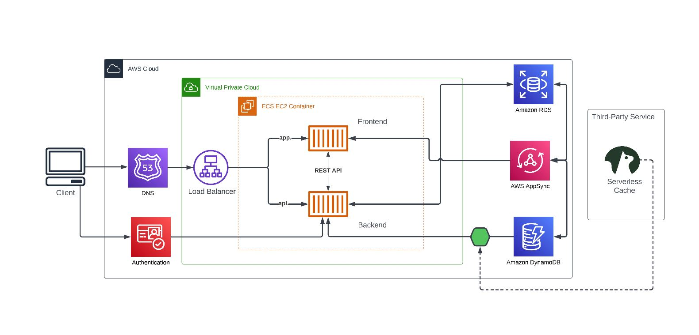
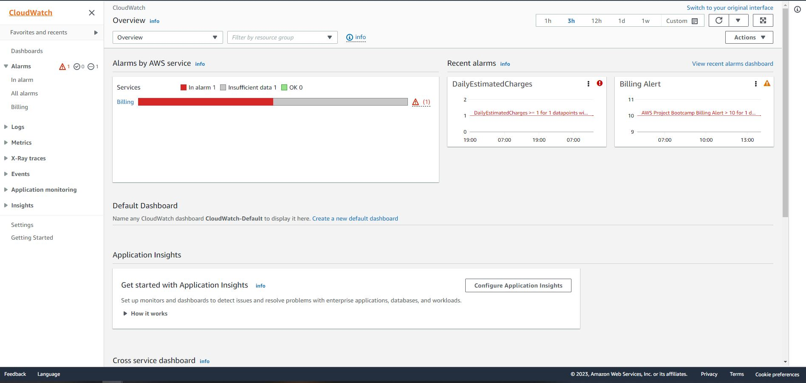
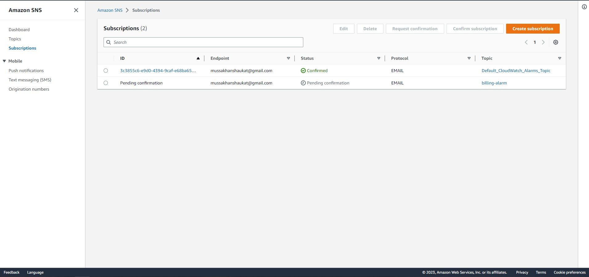
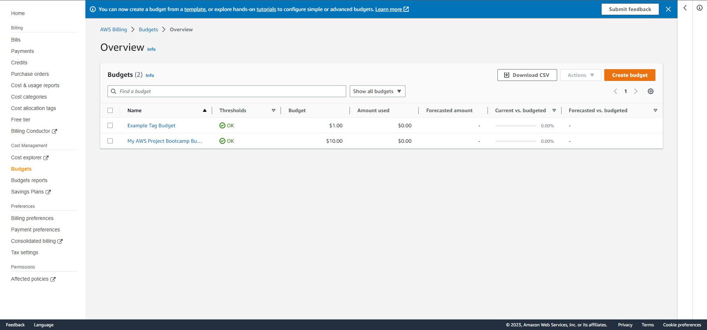

# Week 0 — Billing and Architecture

## Creating Logical Diagram of the Cruddur Application
- Learned About how to work around with Lucid Charts to create your logical Diagram of your Project
- Working Around with different AWS Icons.
- Difference Between AWS Resouce Icons, Service Icons, Groups (Which are like borders of different services e.g. AWS Cloud, ECS EC2 Container) etc
- Importing Your Own Custom SVG Icons and working around them.

 
 

 ## Setting Up Alarms
 - If You want to do it through AWS Dashboard, Go to AWS CloudWatch > on the left side click on Alaram > Click on In Alarm >
   click on create > select metrics > click billing > select metric > select currency > it will open up a window in which you can assign the amount limit, name etc for your alarm metrics > put your email in send notification to > Type Alarm Name > Show you the whole details of your Alarm Metrics Setup Preview > Check and Confirm to setup your alarm.

 

 - to manually setting up alarm from cli follow the steps from this Video
 https://www.youtube.com/watch?v=OdUnNuKylHg&t

 ## Setting Up SNS
 - If you want to setup SNS (Simple Notification Service), go to AWS SNS > go to subscription > check the already created arn (topic) > Check the protocol as an email > 
   Input your email to which this notification would be sent to > click on create subscription
 -  You would also need to confirm your email in order to receive the SNS.

 

 - to manually setting up alarm from cli follow the steps from this Video
 https://www.youtube.com/watch?v=OdUnNuKylHg&t

 ## Setting Up Budget  
 - Go to AWS Budget > click on budget on the left side > click on create budget > check the template (monthly, service based, daily etc) and put your budget name and email 
   address which should be notified when certain budget threshold (percentage of usage) is passed and the amount of budget you can put into it

- to manually setting up alarm from cli follow the steps from this Video
 https://www.youtube.com/watch?v=OdUnNuKylHg&t