# Week 1 — App Containerization

## Run the dockerfile CMD as an external script
- For that you need to external file or script inside your folder and change your docker file.
- Create a file inside your folder e.g. index.js and input this code init

```index.js
import { exec } from 'child_process';

exec('npm start', function (err, stdout, stderr) {
  if (err) console.error(stderr);
  console.log(stdout);
});
```

```dockerfile
FROM node:16.18

ENV PORT=3000

COPY . /frontend-react-js
WORKDIR /frontend-react-js
RUN npm install
EXPOSE ${PORT}
CMD ["node", "index.js"]
```

- After running the container it will execute this file inside the container which will further run the
- whole application

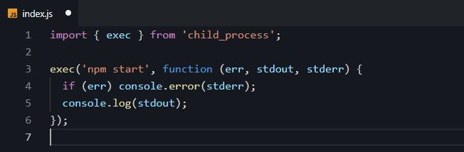


 ## Push and tag a image to DockerHub (they have a free tier)
 - Build your image first e.g. docker build -t frontend-react ./frontend-react-js
 - Run your container "docker run -d -p 3000:3000 frontend-react"
 - Get your running container Id by "docker ps"
 - Now Stage / Commit your container to be pushed to the docker hub by "docker commit docker_image_id your_user_name/name_of_image
 - :tag_you_wanna_put"
 - After that " docker push  your_user_name/name_of_image:tag_you_wanna_put"
 - If your account is not logged in the docker cli than it might ask for your login credentials and after entering that it will push the
 - image to the docker hub.


 ## Use multi-stage building for a Dockerfile build
 - Why we need to use multi-stage building of Dockerfile build ? because it is helpful to lower the image size in the end
 - We divide into many sections depending upon your need and use "AS 'name' " where we know this library or image is gonna 
 - too much space below the file we will use COPY '--from="name" ' to use that build and paste the final stuffs into your
 - other stage of building which helps in minimizing the size of the final image
 - CONS: too much layers of docker image, takes alot of time, you need to build it many times to be sure if it is going to work or not

 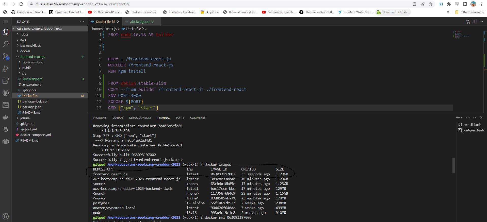
 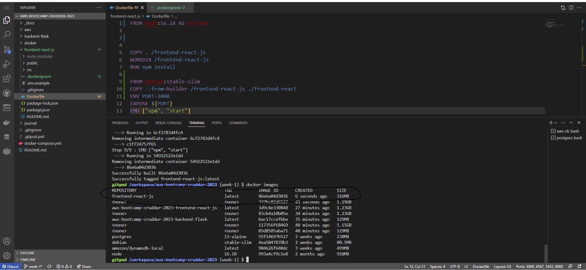

 ## Implement a healthcheck in the V3 Docker compose file  
 - Helpful in checking out of the docker image is functioning properly or not.
 - I have added the healthcheck flags in my frontend build inside the docker-compose.yml file e.g. 

```docker-compose.yml
    healthcheck:
      test: ["CMD", "curl", "-f", "https://3000-mussakhan74-awsbootcamp-anqgfic2c1t.ws-us88.gitpod.io"]
      interval: 1m30s
      timeout: 10s
      retries: 3
      start_period: 40s

```
- This command inside the test flag will check the following URL of the frontend application to check if it working or not. 
- test: This property specifies the command that will be executed and is the health check of the container
- interval: This property specifies the number of seconds to initially wait before executing the health check and then the frequency at 
- which subsequent health checks will be performed.
- timeout: This property specifies the number of seconds Docker awaits for your health check command to return an exit code before 
- declaring it as failed.
- retries: This property specifies the number of consecutive health check failures required to declare the container as unhealthy
- start_period: This property specifies the number of seconds your container needs to bootstrap. 

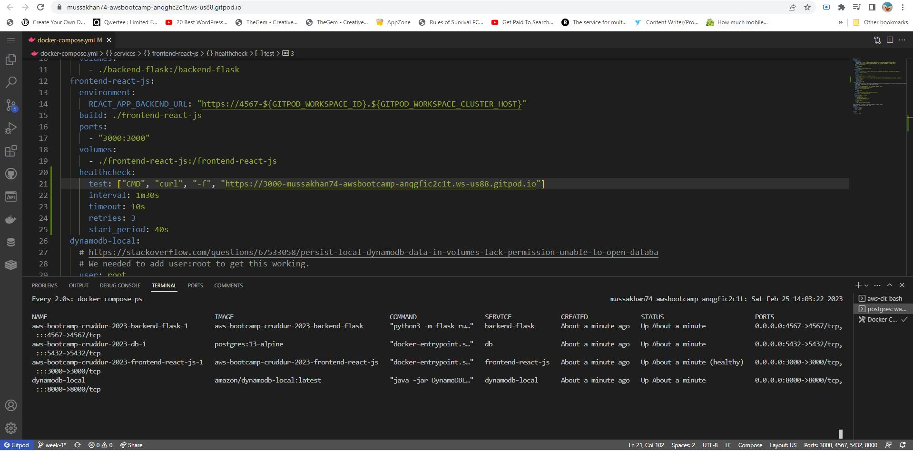


## Research best practices of Dockerfiles and attempt to implement it in your Dockerfile  
 - using less flags inside the dockerfile because each flag works as layer.
 - Having less layes means less time to build and less image size
 - Avoid using multiple same flags instead do it in a single flag
 - Multi-stage build only if you need it or else avoid it.
 - Usage of .dockerignore file.

## Learn how to install Docker on your localmachine and get the same containers running outside of Gitpod / Codespaces  
 - Installed Docker desktop on my local system.
 - You need WSL v2 if you are using windows system.
 - Windows Related bug issue: if you are getting error in cli that docker daemon is not working on window 11 than following below steps;
 - Go to Windows Security > App Browser Control > Exploit Protection Setting > check if the C:\WINDOWS\System32\vmcompute.exe file is 
 - available if not than add it.
 - Open your powershell in administrator mode > put these two commands in it "net start vmcompute", "wsl --set-default-version 2"
 - You might need to restart your pc or docker desktop client in some cases to it work
 - Than it will boot up
 - Docker images worked in same way as I was using in gitpod spaces except there were no PORTS tab, URL's were changed into 
 - localhost:frontendPort | backendPort
 - Also change the FRONTEND_URL and BACKEND_URL to make it work on localmachine

 ## Launch an EC2 instance that has docker installed, and pull a container to demonstrate you can run your own docker processes
 - Open AWS Console on your Non-Root User
 - Search for the EC2 in search Bar & open it
 - On the left side bar it will show instances, click on that.
 - It will open a screen where you put your instance name, the distribution system you want this instance to use, SSH and other settings

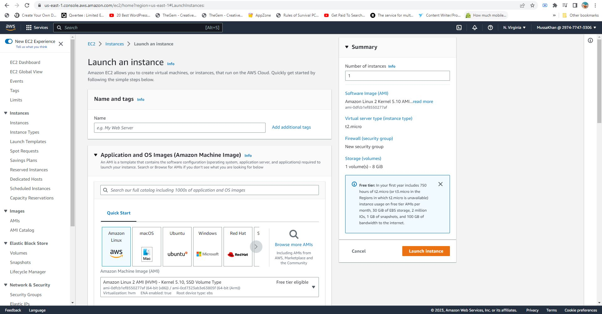

 - After that it will open up the dashboard / list of the running instances which will further show the ips and settings of the instances

 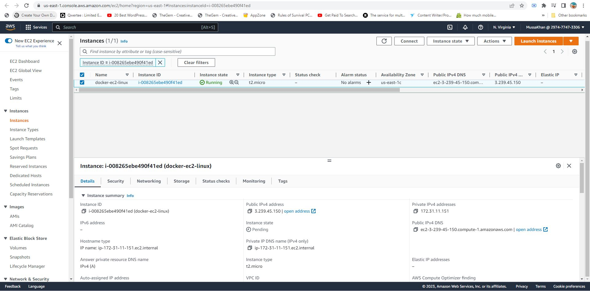
 
 - To connect to this instance from the AWS Cli, need to click on the connect button.

 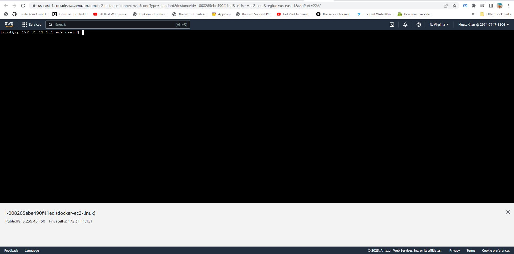

 - Now in this instance we need to install the docker by the following command;
 ```EC2 INSTANCE

 yum install docker* -y

 ``` 
 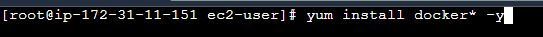

 - After the installation you can try to run the following command in cli to check if the docker is successfully installed or not;
 ```
 docker -v
 ```
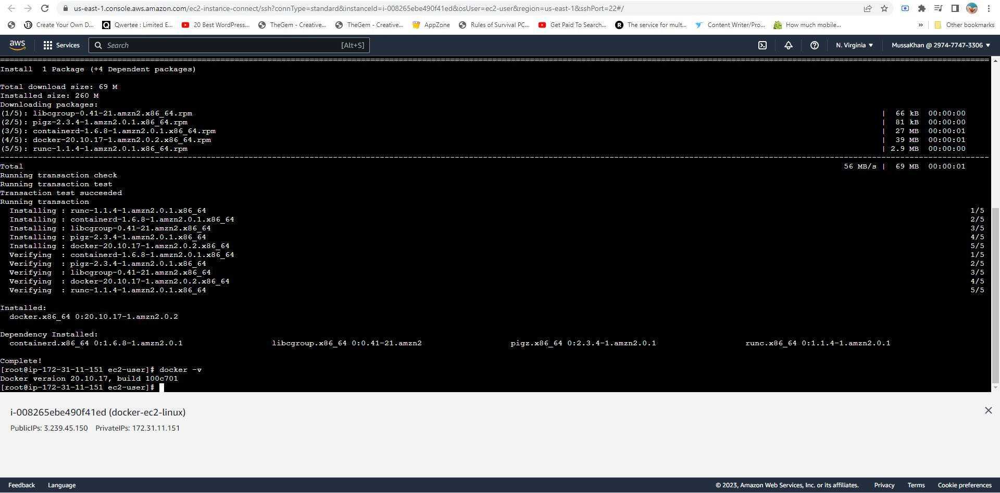

 - By running "docker -v" it doesn't mean your docker is already running on the instance and you can check that by any docker command e.g 

 ```
docker ps
 ```

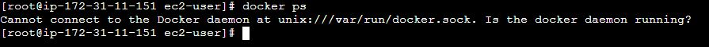

- It will give you an error stating that docker daemon is not running up yet.
- To run the docker on this instance we need to run the following commands;

```
systemctl start docker (It's for running the docker)
systemctl enable docker (It will push it as a service in the instance so even you reboot the instance it will start up on its own)
```

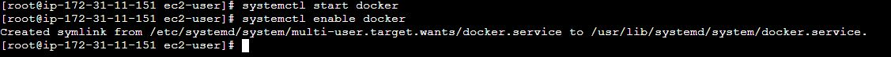

- Now if you type "docker ps" or any other command in the cli it will work perfectly fine for you.

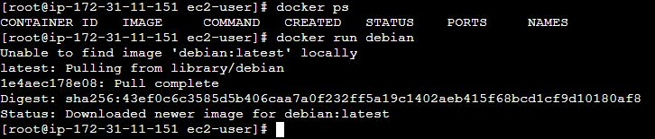