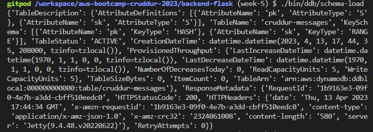
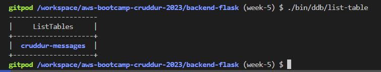
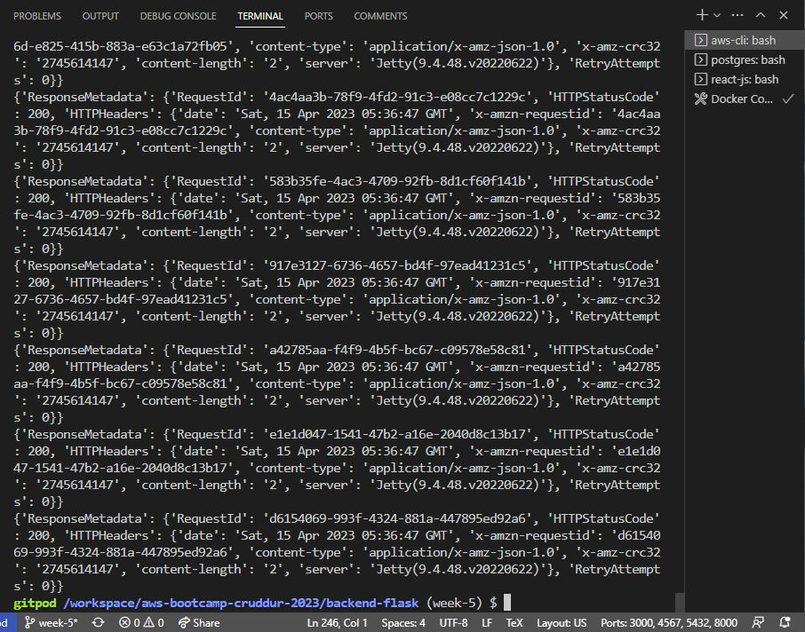
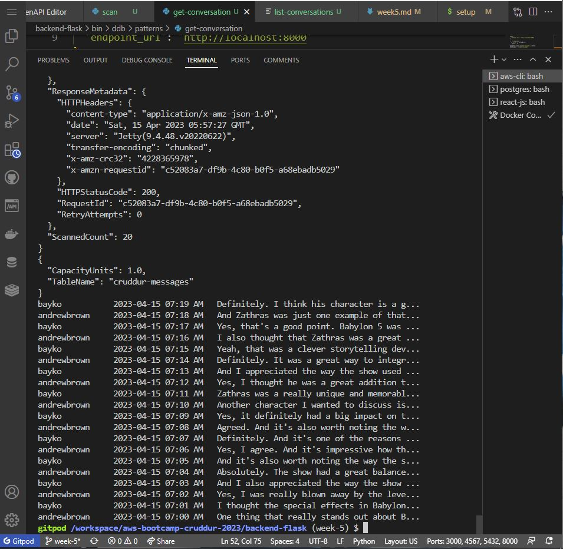
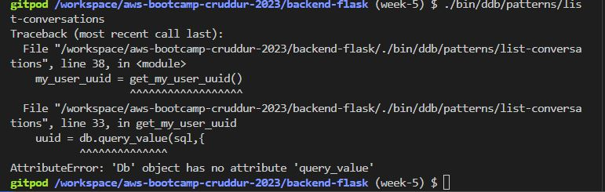

# Week 5 — DynamoDB and Serverless Caching


## Week 5 DynamoDb Utility Scrips
- Renaming and relocating the scripts files
- adding boto3 in requirements.txt file
- installing the boto3 by using command 
    "pip install -r requirements.txt"
- uncomment the dynanmodb from the docker-compose
- create other few bash files for dynamoDb in "backend-flask/bin/ddb"
- updated the path of update-sg-rule in "gitpod.yml" file.

Reference for creating table:
https://boto3.amazonaws.com/v1/documentation/api/latest/reference/services/dynamodb/client/create_table.html


- first file which is created as 
```  "./bin/ddb/schema-load"

#!/usr/bin/env python3

import boto3
import sys

attrs = {
  'endpoint_url': 'http://localhost:8000'
}

if len(sys.argv) == 2:
  if "prod" in sys.argv[1]:
    attrs = {}

ddb = boto3.client('dynamodb',**attrs)

table_name = 'cruddur-messages'


response = ddb.create_table(
  TableName=table_name,
  AttributeDefinitions=[
    {
      'AttributeName': 'pk',
      'AttributeType': 'S'
    },
    {
      'AttributeName': 'sk',
      'AttributeType': 'S'
    },
  ],
  KeySchema=[
    {
      'AttributeName': 'pk',
      'KeyType': 'HASH'
    },
    {
      'AttributeName': 'sk',
      'KeyType': 'RANGE'
    },
  ],
  #GlobalSecondaryIndexes=[
  #],
  BillingMode='PROVISIONED',
  ProvisionedThroughput={
      'ReadCapacityUnits': 5,
      'WriteCapacityUnits': 5
  }
)

print(response)
```
- Run this script to create the table as "cruddur messages"


Reference for listing tables:
https://docs.aws.amazon.com/cli/latest/reference/dynamodb/list-tables.html
- After that we created another bach script by which we can see the tables inside the db;
```"./bin/ddb/list-table"

#! /usr/bin/bash
set -e # stop if it fails at any point

if [ "$1" = "prod" ]; then
  ENDPOINT_URL=""
else
  ENDPOINT_URL="--endpoint-url=http://localhost:8000"
fi

aws dynamodb list-tables $ENDPOINT_URL \
--query TableNames \
--output table
```

- Run this script to list out the table we just created


- After that we will create our dynamDB seed script file
"./bin/ddb/seed"

- After that we will need to run our setup script from db folder "./bin/db/setup" to poulate our seed.sql into the db
- Note: Fixed the path in setup script and insert statement which was missing email to make it work.
- Run the seed file "./bin/ddb/seed" to seed the data into "cruddur-messages" table

- We create our scan script file "./bin/ddb/scan" and run it to check if the data is present inside the "cruddur-messages" table.


- Also we created further pattern scripts "./bin/ddb/patterns/get-conversation" & "./bin/ddb/patterns/list-conversation"
- Ran the "./bin/ddb/patterns/get-conversation" to get the conversation


- Ran the "./bin/ddb/patterns/list-conversation" but it throw an error

- To fix this we will go back to our "lib/db.py" file and add new functionn to make it fun which will make it work and throw conversation into the cli



## Week 5 Implement Conversations with DynamoDB

Create a new file inside the lib folder
``` ddb.py
import boto3
import sys
from datetime import datetime, timedelta, timezone
import uuid
import os
import botocore.exceptions

class Ddb:
  def client():
    endpoint_url = os.getenv("AWS_ENDPOINT_URL")
    if endpoint_url:
      attrs = { 'endpoint_url': endpoint_url }
    else:
      attrs = {}
    dynamodb = boto3.client('dynamodb',**attrs)
    return dynamodb
  def list_message_groups(client,my_user_uuid):
    year = str(datetime.now().year)
    table_name = 'cruddur-messages'
    query_params = {
      'TableName': table_name,
      'KeyConditionExpression': 'pk = :pk AND begins_with(sk,:year)',
      'ScanIndexForward': False,
      'Limit': 20,
      'ExpressionAttributeValues': {
        ':year': {'S': year },
        ':pk': {'S': f"GRP#{my_user_uuid}"}
      }
    }
    print('query-params:',query_params)
    print(query_params)
    # query the table
    response = client.query(**query_params)
    items = response['Items']
    

    results = []
    for item in items:
      last_sent_at = item['sk']['S']
      results.append({
        'uuid': item['message_group_uuid']['S'],
        'display_name': item['user_display_name']['S'],
        'handle': item['user_handle']['S'],
        'message': item['message']['S'],
        'created_at': last_sent_at
      })
    return results
  def list_messages(client,message_group_uuid):
    year = str(datetime.now().year)
    table_name = 'cruddur-messages'
    query_params = {
      'TableName': table_name,
      'KeyConditionExpression': 'pk = :pk AND begins_with(sk,:year)',
      'ScanIndexForward': False,
      'Limit': 20,
      'ExpressionAttributeValues': {
        ':year': {'S': year },
        ':pk': {'S': f"MSG#{message_group_uuid}"}
      }
    }

    response = client.query(**query_params)
    items = response['Items']
    items.reverse()
    results = []
    for item in items:
      created_at = item['sk']['S']
      results.append({
        'uuid': item['message_uuid']['S'],
        'display_name': item['user_display_name']['S'],
        'handle': item['user_handle']['S'],
        'message': item['message']['S'],
        'created_at': created_at
      })
    return results
  def create_message(client,message_group_uuid, message, my_user_uuid, my_user_display_name, my_user_handle):
    now = datetime.now(timezone.utc).astimezone().isoformat()
    created_at = now
    message_uuid = str(uuid.uuid4())

    record = {
      'pk':   {'S': f"MSG#{message_group_uuid}"},
      'sk':   {'S': created_at },
      'message': {'S': message},
      'message_uuid': {'S': message_uuid},
      'user_uuid': {'S': my_user_uuid},
      'user_display_name': {'S': my_user_display_name},
      'user_handle': {'S': my_user_handle}
    }
    # insert the record into the table
    table_name = 'cruddur-messages'
    response = client.put_item(
      TableName=table_name,
      Item=record
    )
    # print the response
    print(response)
    return {
      'message_group_uuid': message_group_uuid,
      'uuid': my_user_uuid,
      'display_name': my_user_display_name,
      'handle':  my_user_handle,
      'message': message,
      'created_at': created_at
    }
  def create_message_group(client, message,my_user_uuid, my_user_display_name, my_user_handle, other_user_uuid, other_user_display_name, other_user_handle):
    print('== create_message_group.1')
    table_name = 'cruddur-messages'

    message_group_uuid = str(uuid.uuid4())
    message_uuid = str(uuid.uuid4())
    now = datetime.now(timezone.utc).astimezone().isoformat()
    last_message_at = now
    created_at = now
    print('== create_message_group.2')

    my_message_group = {
      'pk': {'S': f"GRP#{my_user_uuid}"},
      'sk': {'S': last_message_at},
      'message_group_uuid': {'S': message_group_uuid},
      'message': {'S': message},
      'user_uuid': {'S': other_user_uuid},
      'user_display_name': {'S': other_user_display_name},
      'user_handle':  {'S': other_user_handle}
    }

    print('== create_message_group.3')
    other_message_group = {
      'pk': {'S': f"GRP#{other_user_uuid}"},
      'sk': {'S': last_message_at},
      'message_group_uuid': {'S': message_group_uuid},
      'message': {'S': message},
      'user_uuid': {'S': my_user_uuid},
      'user_display_name': {'S': my_user_display_name},
      'user_handle':  {'S': my_user_handle}
    }

    print('== create_message_group.4')
    message = {
      'pk':   {'S': f"MSG#{message_group_uuid}"},
      'sk':   {'S': created_at },
      'message': {'S': message},
      'message_uuid': {'S': message_uuid},
      'user_uuid': {'S': my_user_uuid},
      'user_display_name': {'S': my_user_display_name},
      'user_handle': {'S': my_user_handle}
    }

    items = {
      table_name: [
        {'PutRequest': {'Item': my_message_group}},
        {'PutRequest': {'Item': other_message_group}},
        {'PutRequest': {'Item': message}}
      ]
    }

    try:
      print('== create_message_group.try')
      # Begin the transaction
      response = client.batch_write_item(RequestItems=items)
      return {
        'message_group_uuid': message_group_uuid
      }
    except botocore.exceptions.ClientError as e:
      print('== create_message_group.error')
      print(e)
```

This will include couple of funtions e.g. create messages, list group of messages etc.

Reference to list-users: https://docs.aws.amazon.com/cli/latest/reference/cognito-idp/list-users.html

Created a new file to list-users from cognito
``` bin/cognito/list-users
#!/usr/bin/env python3

import boto3
import os
import json

userpool_id = os.getenv("AWS_COGNITO_USER_POOL_ID")
client = boto3.client('cognito-idp')
params = {
  'UserPoolId': userpool_id,
  'AttributesToGet': [
      'preferred_username',
      'sub'
  ]
}
response = client.list_users(**params)
users = response['Users']

print(json.dumps(users, sort_keys=True, indent=2, default=str))

dict_users = {}
for user in users:
  attrs = user['Attributes']
  sub    = next((a for a in attrs if a["Name"] == 'sub'), None)
  handle = next((a for a in attrs if a["Name"] == 'preferred_username'), None)
  dict_users[handle['Value']] = sub['Value']

print(json.dumps(dict_users, sort_keys=True, indent=2, default=str))
```
Run this new script and it will list the cognito users.

Saving Environment Variable for AWS Cognito User Pool Id
Updated Docker-Compose file  <--Line.17

Created a new file which will update the cognito users ids
``` ./bin/db/update-cognito-user-ids
#!/usr/bin/env python3

import boto3
import os
import sys

print("== db-update-cognito-user-ids")

current_path = os.path.dirname(os.path.abspath(__file__))
parent_path = os.path.abspath(os.path.join(current_path, '..', '..'))
sys.path.append(parent_path)
from lib.db import db

def update_users_with_cognito_user_id(handle,sub):
  sql = """
    UPDATE public.users
    SET cognito_user_id = %(sub)s
    WHERE
      users.handle = %(handle)s;
  """
  db.query_commit(sql,{
    'handle' : handle,
    'sub' : sub
  })

def get_cognito_user_ids():
  userpool_id = os.getenv("AWS_COGNITO_USER_POOL_ID")
  client = boto3.client('cognito-idp')
  params = {
    'UserPoolId': userpool_id,
    'AttributesToGet': [
        'preferred_username',
        'sub'
    ]
  }
  response = client.list_users(**params)
  users = response['Users']
  dict_users = {}
  for user in users:
    attrs = user['Attributes']
    sub    = next((a for a in attrs if a["Name"] == 'sub'), None)
    handle = next((a for a in attrs if a["Name"] == 'preferred_username'), None)
    dict_users[handle['Value']] = sub['Value']
  return dict_users


users = get_cognito_user_ids()

for handle, sub in users.items():
  print('----',handle,sub)
  update_users_with_cognito_user_id(
    handle=handle,
    sub=sub
  )
```
Updated lib/db.py file <--Line.42
Run Scripts "./bin/db/setup" & "./bin/db/update-cognito-user-ids"
Updated app.py file <--Line.125
``` app.py
@app.route("/api/message_groups", methods=['GET'])
def data_message_groups():
  access_token = extract_access_token(request.headers)
  try:
    claims = cognito_jwt_token.verify(access_token)
    # authenicatied request
    app.logger.debug("authenicated")
    app.logger.debug(claims)
    cognito_user_id = claim['sub']
    model = MessageGroups.run(cognito_user_id=cognito_user_id)
    if model['errors'] is not None:
      return model['errors'], 422
    else:
      return model['data'], 200
  except TokenVerifyError as e:
    # unauthenicatied request
    app.logger.debug(e)
    return {}, 401
```
Update file "message_groups.py"
``` services/message_groups.py
from datetime import datetime, timedelta, timezone

from lib.ddb import Ddb
from lib.db import db

class MessageGroups:
  def run(cognito_user_id):
    model = {
      'errors': None,
      'data': None
    }

    sql = db.template('users','uuid_from_cognito_user_id')
    my_user_uuid = db.query_value(sql,{
      'cognito_user_id': cognito_user_id
    })

    print(f"UUID: {my_user_uuid}")

    ddb = Ddb.client()
    data = Ddb.list_message_groups(ddb, my_user_uuid)
    print("list_message_groups:",data)

    model['data'] = data
    return model
```
Create a new sql file
``` db/sql/users/uuid_from_cognito_user_id.sql
SELECT
  users.uuid
FROM public.users
WHERE 
  users.cognito_user_id = %(cognito_user_id)s
LIMIT 1
```
Passing headers in the fetch functions of the frontend side pages
MessageGroupsPage.js <--Line.20
MessageGroupPage.js <--Line.25
MessageForm.js <--Line.25

- Fixed Issue: In seed.sql we had mockup data of andrew and bayko which was causing issue with script update_cognito_user_ids which was only running it for my original one user already created in the cognito pool connected to rds. To fix that I had to signup with second email address and I put the data of both emails into seed.sql file which helped me out to run the update_cognito_user_ids script and it was able to append the "MOCK" data.

