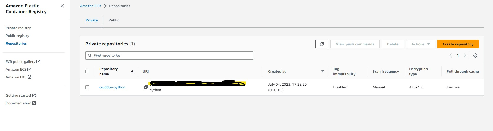

# Week 6 — Deploying Containers

## ECS FARGATE
- We need to have health check for different things like dbs, containers etc. So for that we are going to create scripts to check them out.

- We need to create a test file for our rds; 
```  "./bin/db/test"

#!/usr/bin/env python3

import psycopg
import os
import sys

connection_url = os.getenv("CONNECTION_URL")

conn = None
try:
  print('attempting connection')
  conn = psycopg.connect(connection_url)
  print("Connection successful!")
except psycopg.Error as e:
  print("Unable to connect to the database:", e)
finally:
  conn.close()
```


- after that we are going to run our security rule group script and and run our above test script and it will show success message.

- we are also going to make test url endpoint for our flask app to do a health check for which;

``` "backend-flask/app.py | line 128 - 130"

@app.route('/api/health-check')
def health_check():
  return {'success': True}, 200
```
- and create a new script for flask app to check health

```"./bin/flask/health-check"

#!/usr/bin/env python3

import urllib.request

try:
  response = urllib.request.urlopen('http://localhost:4567/api/health-check')
  if response.getcode() == 200:
    print("[OK] Flask server is running")
    exit(0) # success
  else:
    print("[BAD] Flask server is not running")
    exit(1) # false
# This for some reason is not capturing the error....
#except ConnectionRefusedError as e:
# so we'll just catch on all even though this is a bad practice
except Exception as e:
  print(e)
  exit(1) # false
```

- Note: We could have used bash script and used curl instead of python script but docker container doesn't have curl or any networking debugging tools by default so it will create a security risk for your container and someone can easily access.

- We will also enable the cloud log for our application and change it's retention time to 1 day to keep our cost minimum. Note: Usually we don't keep the retention time to 1 day but it is just to save our logging cost.

``` "Run these commands in CLI to create cloud-watch group"
aws logs create-log-group --log-group-name "/cruddur/fargate-cluster"
aws logs put-retention-policy --log-group-name "/cruddur/fargate-cluster" --retention-in-days 1
```


- We will create our ECS (Amazon Elastic Container Service) by running following CLI Commands

```"Run these commands in CLI to create ECS"
aws ecs create-cluster \
--cluster-name cruddur \
--service-connect-defaults namespace=cruddur
```


- Now we are going to create our ECR (Amazon Elastic Container Registry) for our containers.
- Note: Instead of pulling python or node image directly from the docker registry we are going to push them to our ECR Repo because sometimes docker registry is going to give us error e.g. your pulling this image-name too many etc
- First we are going to push our python repository using cli commands

```"Run these commands in CLI to create ECR repo for base-image python"

aws ecr create-repository \
  --repository-name cruddur-python \
  --image-tag-mutability MUTABLE
```




- After that we are going to confirm from aws dashboard that our repo for python image is created or note. 
- We need to check AWS ECR dashboard > Repositories > Repo Name (cruddur-python) > View Push Commands
- This will show us the command to build our python image 
- We will set our env variable of ECR_PYTHON_URL

``` "run this command in cli for setting env var for ecr-python-repository"
export ECR_PYTHON_URL="$AWS_ACCOUNT_ID.dkr.ecr.$AWS_DEFAULT_REGION.amazonaws.com/cruddur-python"
```

``` "run this command in cli for Pulling python image from docker"
docker pull python:3.10-slim-buster
```

``` "run this command in cli tagging our python image"
docker tag python:3.10-slim-buster $ECR_PYTHON_URL:3.10-slim-buster
```

``` "run this command in cli to push our local docker image to aws ECR repository of python "
docker push $ECR_PYTHON_URL:3.10-slim-buster
```

- NOTE: before pushing the image we need to go AWS ECR dashboard > Repositories > Repo Name (cruddur-python) > View Push Commands > Copy the Login credentials so you are able to push your repo or else it would end up giving you error "no basic auth credential".


- we are going to update our dockerfile for backend-flask app so it can pull the python image from ECR

- if we run the docker compose up it will give us error because we already have the python image already so we might need to remove it by running 

``` "run these commands in cli to remove docker image"
docker images rm "image-name:tag"

"to confirm run:"

docker images
```

- now we will will run our docker-copmpose file by

``` "run this command in cli to run docker-compose"
docker compose up backend-flask db 
# We can specify after docker compose up to which service to run by putting their name in it mentioned inside docker-compose.yml
```

- NOTE: need to update the rollabar section in the app.py of backend-flask or else the app won't stop because some function are depricated in flask 2.2 

``` "./backend-flask/app.py | Line-86"
# @app.before_first_request | old method which doesn't work in flask 2.2 now (depricated)
with app.app_context():
  def init_rollbar():
      """init rollbar module"""
      rollbar.init(
          # access token
          rollbar_access_token,
          # environment name
          'production',
          # server root directory, makes tracebacks prettier
          root=os.path.dirname(os.path.realpath(__file__)),
          # flask already sets up logging
          allow_logging_basic_config=False)

      # send exceptions from `app` to rollbar, using flask's signal system.
      got_request_exception.connect(rollbar.contrib.flask.report_exception, app)
```
- after this run the backend url in the new tab of browser and hit the endpoint /api/health-check to see if the app is working or not.


- Now we are going to build our backend-flask image by running following commands:

``` "run following commands in cli to build backend-flask repository"
- To Create Repo in ECR
aws ecr create-repository \
  --repository-name backend-flask \
  --image-tag-mutability MUTABLE

- To set Env Var
export ECR_BACKEND_FLASK_URL="$AWS_ACCOUNT_ID.dkr.ecr.$AWS_DEFAULT_REGION.amazonaws.com/backend-flask"

echo $ECR_BACKEND_FLASK_URL

-to Build Image
docker build -t backend-flask .

- To Tag Image
docker tag backend-flask:latest $ECR_BACKEND_FLASK_URL:latest

- To push image to ECR
docker push $ECR_BACKEND_FLASK_URL:latest
```


- Note: we deleted our previously created 'cruddur/fargate-cluster' cloudwatch log group and again made 'cruddur' log group

- We will create a new file in aws/policies/service-execution-policy.json file

``` "aws/policies/service-execution-policy.json"
{
  "Version":"2012-10-17",
  "Statement":[{
    "Action":["sts:AssumeRole"],
    "Effect":"Allow",
    "Principal":{
      "Service":["ecs-tasks.amazonaws.com"]
    }
  }]
}
```

- after that run the cli command to create iam role

``` "run this command in cli but need to make sure you base folder"
aws iam create-role \
    --role-name CruddurServiceExecutionRole \
    --assume-role-policy-document file://aws/policies/service-execution-policy.json
```


- we will create task definition by using following commands into the cli

```
aws ssm put-parameter --type "SecureString" --name "/cruddur/backend-flask/AWS_ACCESS_KEY_ID" --value $AWS_ACCESS_KEY_ID
aws ssm put-parameter --type "SecureString" --name "/cruddur/backend-flask/AWS_SECRET_ACCESS_KEY" --value $AWS_SECRET_ACCESS_KEY
aws ssm put-parameter --type "SecureString" --name "/cruddur/backend-flask/CONNECTION_URL" --value $PROD_CONNECTION_URL
aws ssm put-parameter --type "SecureString" --name "/cruddur/backend-flask/ROLLBAR_ACCESS_TOKEN" --value $ROLLBAR_ACCESS_TOKEN
aws ssm put-parameter --type "SecureString" --name "/cruddur/backend-flask/OTEL_EXPORTER_OTLP_HEADERS" --value "x-honeycomb-team=$HONEYCOMB_API_KEY"
```


- we will run following commands into the cli to create task and executions roles

```
Execution Role
aws iam create-role \
    --role-name CruddurServiceExecutionRole \
    --assume-role-policy-document "{
  \"Version\":\"2012-10-17\",
  \"Statement\":[{
    \"Action\":[\"sts:AssumeRole\"],
    \"Effect\":\"Allow\",
    \"Principal\":{
      \"Service\":[\"ecs-tasks.amazonaws.com\"]
    }
  }]
}"

Task Roles
aws iam create-role \
    --role-name CruddurTaskRole \
    --assume-role-policy-document "{
  \"Version\":\"2012-10-17\",
  \"Statement\":[{
    \"Action\":[\"sts:AssumeRole\"],
    \"Effect\":\"Allow\",
    \"Principal\":{
      \"Service\":[\"ecs-tasks.amazonaws.com\"]
    }
  }]
}"

aws iam put-role-policy \
  --policy-name SSMAccessPolicy \
  --role-name CruddurTaskRole \
  --policy-document "{
  \"Version\":\"2012-10-17\",
  \"Statement\":[{
    \"Action\":[
      \"ssmmessages:CreateControlChannel\",
      \"ssmmessages:CreateDataChannel\",
      \"ssmmessages:OpenControlChannel\",
      \"ssmmessages:OpenDataChannel\"
    ],
    \"Effect\":\"Allow\",
    \"Resource\":\"*\"
  }]
}
"

aws iam attach-role-policy --policy-arn arn:aws:iam::aws:policy/CloudWatchFullAccess --role-name CruddurTaskRole
aws iam attach-role-policy --policy-arn arn:aws:iam::aws:policy/AWSXRayDaemonWriteAccess --role-name CruddurTaskRole

```

- after being done with that we will create our task definition "aws/task-definition/backend-flask.json"
- update your ecr-repo URL, env var with your docker compose files, executionRoleArn, and taskRoleArn etc.
- NOTE: whenever we update this "aws/task-definitions/backend-flask.json" file we need to run the following command in the cli to update the changes
```
aws ecs register-task-definition --cli-input-json file://aws/task-definitions/backend-flask.json
```


- we will run some cli commands to create the security group for our backend-flask ECS and get default vpc and open the port 80 for it.
```
-To Get Default VPC

export DEFAULT_VPC_ID=$(aws ec2 describe-vpcs \
--filters "Name=isDefault, Values=true" \
--query "Vpcs[0].VpcId" \
--output text)
echo $DEFAULT_VPC_ID

-To create security group

export CRUD_SERVICE_SG=$(aws ec2 create-security-group \
  --group-name "crud-srv-sg" \
  --description "Security group for Cruddur services on ECS" \
  --vpc-id $DEFAULT_VPC_ID \
  --query "GroupId" --output text)
echo $CRUD_SERVICE_SG

-To open port 80

aws ec2 authorize-security-group-ingress \
  --group-id $CRUD_SERVICE_SG \
  --protocol tcp \
  --port 80 \
  --cidr 0.0.0.0/0

```
- Now we will create the backend-flask container


- After that we will need to add some permission policy to run an ECS container or else it won't run
```
{
  "Version": "2012-10-17",
  "Statement": [
    {
      "Effect": "Allow",
      "Action": [
        "ecr:GetAuthorizationToken",
        "ecr:BatchCheckLayerAvailability",
        "ecr:GetDownloadUrlForLayer",
        "ecr:BatchGetImage",
        "logs:CreateLogStream",
        "logs:PutLogEvents"
      ],
      "Resource": "*"
    }
  ]
}
```


